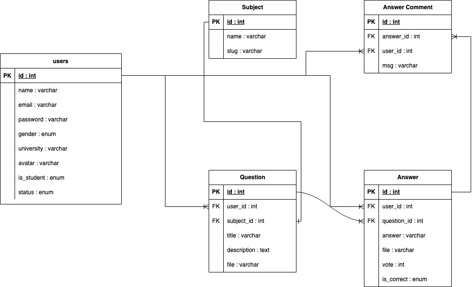

# DiskusiTugas

Saat saya mengikuti program Kampus Merdeka : Studi Independen Batch 5. Project ini merupakan hasil belajar saya di Alterra Academy, saya mengambil learning path 100% Mastering Golang Programming.

DiskusiTugas merupakan platform tanya jawab yang dirancang untuk membantu mahasiswa dalam menyelesaikan berbagai jenis tugas. Mahasiswa dapat dengan mudah menemukan topik yang relevan dengan mata kuliah mereka, dan kemudian mengajukan pertanyaan yang relevan. Selain itu, DiskusiTugas juga menyediakan ruang untuk menjawab pertanyaan dari sesama mahasiswa yang mungkin lebih memahami topik tersebut.

## Fitur Utama

Rest API ini memiliki beberapa fitur utama, termasuk:

- [Admin] Mengelola data mata kuliah.
- [Admin] Mengelola akun user termasuk untuk blokir akun mahasiswa.
- [Mahasiswa] Dapat melakukan login dan register akun.
- [Mahasiswa] Dapat membuat pertanyaan baik berupa teks maupun gambar/file.
- [Mahasiswa] Dapat menandai jawaban yang benar dari hasil diskusi.
- [Mahasiswa] Dapat menjawab pertanyaan bisa berupa teks maupun gambar/file.
- [Mahasiswa] Dapat melakukan vote up dan down terhadap jawaban.
- [Mahasiswa] Setiap mahasiswa dapat mengomentari jawaban yang sudah diberikan.
- [AI] Memberikan bantuan dengan menjawab pertanyaan tanpa terlibat dalam diskusi, seperti chat bot untuk pertanyaan yang sederhana.

## Library yang Dipakai

```go
go get github.com/labstack/echo/v4
go get github.com/go-playground/validator/v10
go get -u gorm.io/gorm
go get -u gorm.io/driver/mysql
go get github.com/joho/godotenv
go get github.com/sirupsen/logrus
go get -u github.com/golang-jwt/jwt/v5
go get github.com/labstack/echo-jwt/v4
go get -u github.com/stretchr/testify
go get github.com/DATA-DOG/go-sqlmock
go get github.com/cloudinary/cloudinary-go/v2
```
## Rancangan ERD

